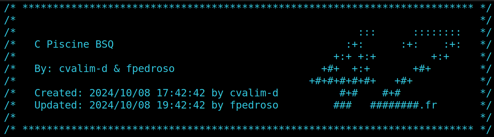

# Largest Square Finder



This program finds and marks the largest square of empty spaces (represented by `.`) in a 2D map, filling it with `X`.

## Constants

- `ROWS` - Number of rows in the map (10).
- `COLS` - Number of columns in the map (10).
- `CHAR_EMPTY` - Character representing an empty space (`.`).
- `CHAR_FULL` - Character representing a filled space (`X`).

## Functions

### `void find_max_square(char map[ROWS][COLS]);`

Finds the largest square of empty spaces in the given map.

```c
void find_max_square(char map[ROWS][COLS])
{
    int square_size;             // Current size of the square being checked
    int max_coord_x;            // X coordinate of the top-left corner of the largest square found
    int max_coord_y;            // Y coordinate of the top-left corner of the largest square found
    int biggest_size;           // Size of the largest square found
    int found_space;            // Flag to indicate if a square was found

    square_size = 1;            // Start with a square of size 1
    max_coord_x = -1;           // Initialize coordinates to -1 (not found)
    max_coord_y = -1;           // Initialize coordinates to -1 (not found)
    biggest_size = 0;           // Initialize biggest size to 0

    while (1)                   // Infinite loop to find larger squares
    {
        found_space = 0;       // Reset flag for each size check
        check_all_squares(map, square_size, &max_coord_x, &max_coord_y,
            &biggest_size, &found_space); // Check for squares of current size

        if (found_space)       // If a square was found
            square_size++;     // Increase the size for the next iteration
        else
            break;             // Exit if no square was found
    }
    if (biggest_size > 0)     // If a largest square was found
        mark_square(map, max_coord_x, max_coord_y, biggest_size); // Mark it on the map
}
```

### `void check_all_squares(char map[ROWS][COLS], int square_size, int *max_coord_x, int *max_coord_y, int *biggest_size, int *found_space);`

Checks all possible coordinates to find a square of a given size.

```c
void check_all_squares(char map[ROWS][COLS], int square_size,
    int *max_coord_x, int *max_coord_y, int *biggest_size, int *found_space)
{
    int coord_x;              // Current X coordinate being checked
    int coord_y;              // Current Y coordinate being checked

    coord_x = 0;              // Start checking from the top-left corner
    while (coord_x <= ROWS - square_size) // Ensure square fits vertically
    {
        coord_y = 0;          // Reset Y coordinate for each new X coordinate
        while (coord_y <= COLS - square_size) // Ensure square fits horizontally
        {
            if (check_fit_square(map, coord_x, coord_y, square_size)) // Check if square fits
            {
                *found_space = 1;             // Mark that a square was found
                *biggest_size = square_size;  // Update the size of the biggest square found
                *max_coord_x = coord_x;       // Update the X coordinate
                *max_coord_y = coord_y;       // Update the Y coordinate
                break;                         // Exit the inner loop
            }
            coord_y++;                        // Move to the next Y coordinate
        }
        coord_x++;                            // Move to the next X coordinate
    }
}
```

### `int check_fit_square(char map[ROWS][COLS], int coord_x, int coord_y, int square_size);`

Checks if a square of a specified size fits at the given coordinates.

```c
int check_fit_square(char map[ROWS][COLS], int coord_x, int coord_y,
    int square_size)
{
    int i;                          // Loop counter for rows
    int j;                          // Loop counter for columns

    if (coord_x + square_size <= ROWS && coord_y + square_size <= COLS) // Check bounds
    {
        i = 0;
        while (i < square_size) // Iterate over rows of the square
        {
            j = 0;
            while (j < square_size) // Iterate over columns of the square
            {
                if (map[coord_x + i][coord_y + j] != CHAR_EMPTY) // Check if cell is empty
                {
                    return (0); // Square does not fit
                }
                j++; // Move to the next column
            }
            i++; // Move to the next row
        }
        return (1); // Square fits
    }
    return (0); // Square does not fit due to bounds
}
```

### `void mark_square(char map[ROWS][COLS], int coord_x, int coord_y, int square_size);`

Marks a square on the map by changing empty characters to full characters.

```void mark_square(char map[ROWS][COLS], int coord_x, int coord_y,
    int square_size)
{
    int i;                          // Loop counter for rows
    int j;                          // Loop counter for columns

    i = 0;
    while (i < square_size) // Iterate over rows of the square
    {
        j = 0;
        while (j < square_size) // Iterate over columns of the square
        {
            map[coord_x + i][coord_y + j] = CHAR_FULL; // Mark the cell as full
            j++; // Move to the next column
        }
        i++; // Move to the next row
    }
}
```

### `void print_map(char mapa[ROWS][COLS]);`

Prints the current state of the map.

```c
void print_map(char mapa[ROWS][COLS])
{
    int i;                          // Loop counter for rows
    int j;                          // Loop counter for columns

    i = 0;
    while (i < ROWS) // Iterate over each row
    {
        j = 0;
        while (j < COLS) // Iterate over each column
        {
            ft_putchar(mapa[i][j]); // Print each character
            j++; // Move to the next column
        }
        ft_putstr("\n"); // New line after each row
        i++; // Move to the next row
    }
}
```
